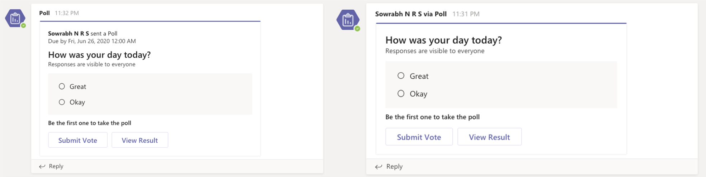

# User Attribution by Bots in Teams

Today when a bot sends a message, the sender name is always displayed to be the bot name. However, in several scenarios bots send on behalf of a user. Showing a user name as the sender increases engagement. This feature allows you to send messages on behalf of a user who is sending the message. 

In the screenshots below, the left side is the card how a message sent by a bot looks like without this feature. On the right is how the message sender looks like with user attribution.


To use user attribution in teams, you need to add one `OnBehalfOf` mention entity to `ChannelData` in your `Activity` payload that is sent to Teams.

This is how a sample JSON would look like -
```json
{
    "ChannelData": {       
        "OnBehalfOf": [{
            "itemid": 0,
            "mentionType": "person",
            "mri": "29:orgid:89e6508d-6c0f-4ffe-9f6a-b58416d965ae",
            "displayName": "Sowrabh N R S"
        }]
    }
}
```
## Details of the `OnBehalfOf` entity schema
|Field|Type|Description|
|:---|:---|:---|
|`itemId`|Integer|Should be 0|
|`mentionType`|String|Should be "person"|
|`mri`|String|MRI of the person on behalf of who the message is sent. Message sender name would appear as "<user> via <bot name>".|
|`displayName`|String|Name of the person. Used as fallback in case name resolution is unavailable|
